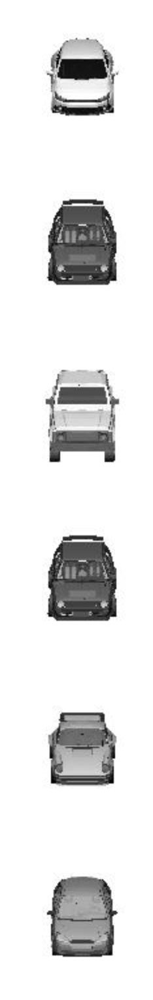

# IIAE(Interaction Information AutoEncoder) - Pytorch Implementation

Pytorch Implementation of [Variational Interaction Information Maximization for Cross-domain Disentanglement(IIAE)](https://proceedings.neurips.cc/paper/2020/file/fe663a72b27bdc613873fbbb512f6f67-Paper.pdf)

This implementation is focused on Image-to-Image translation task of IIAE.


Official Repository(tensorflow implementation) is [here](https://github.com/gr8joo/IIAE).


<p align="center"></p>

---
## Dependencies
To resolve the dependencies manually, install
- python >= 3.6
- torch==1.7.1+cu110
- torchvision==0.8.2+cu110
- json
- tensorboard

Or if you are using Anaconda, simply run command
```
# create same conda environment

conda env create -f requirements.txt
```
---
## Datasets
### Datasets
1. MNIST-CDCB
2. Cars
3. AFHQ (Stil working for high quality result)

### Download datasets
for MNIST-CDCB, 
```
# Download MNIST-CDCB dataset
sudo bash download_mnist_cbcd.sh
```

for Cars,
```
# Download Cars dataset
sudo bash download_mnist_Cars.sh
```
for AFHQ, (download.sh file is from [stargan v2 official repository](https://github.com/clovaai/stargan-v2))

```
# Download AFHQ dataset
sudo bash download.sh afhq-dataset
```

### Preprocess datasets

MNIST-CDCB dataset and Cars dataset need to be preprocessed.
You can preprocess the datasets for the network by running the codes in 'dataloader' directory

```
# for MNIST-CDCB,
python preprocess_mnist.py

# for AFHQ,
python preprocess_cars.py
```

When you try to run the preprocessing code, permission error can be occured.
The error can be resolved by this command.
```
sudo chmod 0777 <directory>
```
---
## Train / Test Network

With following command and config file, you can train and test the network.

```
python main.py <config file path>
```
### Config 
Here is the sample config file. Please follow the template.  
Set **train: 1** for train, **train: 0** for test.

```
{
    "id": "IIAE_MNIST",
    "model": "IIAE",
    "dataset": "MNIST-CDCB",
    "path_to_data": "./MNIST-CDCB",
    "train" : 1,  
    "resolution": 256,
    "training": {
        "max_iters": 50000,
        "resume_iters": 0,
        "restored_model_path": "",
        "batch_size": 16,
        "lr": 0.00002,
        "weight_decay": 0.0,
        "beta1" : 0.9,
        "beta2" : 0.999,
        "milestones": [10000, 30000], 
        "scheduler_gamma": 0.5,
        "rec_weight": 100.02,
        "X_kld_weight": 5.02,
        "S_kld_weight": 0.02,
        "inter_kld_weight": 5,
        "print_freq": 100,
        "sample_freq": 2000,
        "model_save_freq": 5000
    },
    "test":{
        "test_iters": 50000,
        "batch_size" : 16,
        "test_path": "./2021-08-06_22-14_IIAE_MNIST"
    }
}
```

---
## Sample  Results
### 1. MNIST-CDCB
**Domain Specific representation** : Color Foreground / Background  
**Domain Shared representation** : Digit Identity

- X: Colored background
- Y: Colored foreground(digit)

**Experiment1 : < X to Y with different z_y(foreground color) >**

|X(input)|Outputs with diffferentt z_y|X to Y(reference)|Y(reference)|
|:---:|:---:|:---:|:---:|
|||||

**Experiment2 : < Y to X with different z_x(background color) >**  
|Y(input)|Outputs with diffferentt z_x|Y to X(reference)|X(reference)|
|:---:|:---:|:---:|:---:|
|||||

**Experiment3 : < X to Y with different digits >**  
  
Digit Identity from X, Foreground Color from Y

|X(Digit Identity)|Output|Y(Foreground Color)|
|:---:|:---:|:---:|
||||

**Experiment4 : < Y to X with different digit identity >**
  
    

Digit Identity from Y, Background Color from X

|Y(Digit Identity)|Output|X(Background Color)|
|:---:|:---:|:---:|
||||

### 2. Cars 
**Domain Specific representation** : Rotated Angle  
**Domain Shared representation** : Car Identity

- X: Front view
- Y: View in 23 different degrees

**Experiment1 : < X to Y with different z_y(Angles) >**

|X(input)|Outputs with diffferentt z_y|X to Y(reference)|Y(reference)|
|:---:|:---:|:---:|:---:|
|||||

**Experiment2 : < Y to X with different z_x(front) >**
|Y(input)|Outputs with diffferentt z_x|Y to X(reference)|X(reference)|
|:---:|:---:|:---:|:---:|
|||||

**Experiment3 : < X to Y with different car identity >**
  
    
Car Identity from X, Rotated Angle from Y

|X(Car Identity)|Output|Y(Rotated Angle)|
|:---:|:---:|:---:|
||||

**Experiment4 : < Y to X with different car identity >**
  
    
Car Identity from Y, Rotated Angle from X

|Y(Car Identity)|Output|X(Rotated Angle)|
|:---:|:---:|:---:|
||||

### 3. AFHQ
- **Leftmost column**: Input Image
- **Rightmost column**: Reference image


**Results with 1000000 iterations**
|Cat to Dog|
|:---:|
||

|Dog to Cat|
|:---:|
||

---
## References
1. https://github.com/gr8joo/IIAE
2. https://github.com/clovaai/stargan-v2
3. https://github.com/SKTBrain/DiscoGAN
4. https://github.com/agonzgarc/cross-domain-disen
